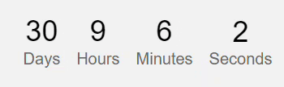

# CountdownTimer-Odometer

This project is a simple web application that displays a countdown timer using the Odometer library. It calculates the time remaining until a specified target date and updates the display in real-time.

## Features

- Countdown timer displayed in days, hours, minutes, and seconds.
- Uses AJAX to fetch the server time from the Public Api`https://worldtimeapi.org/api/timezone/Africa/Algiers`.
- Updates the countdown timer every second.

## Demo :




## Usage

To use this project, follow these steps:


 ```sh
   git clone https://github.com/mounirzx/CountdownTimer-Odometer.git
```


2. Open the `index.html` file in a web browser.

3. The countdown timer will start automatically, displaying the time remaining until the target date.

## Configuration

You can customize the target date by modifying the `targetDate` variable in the `index.html` file. By default, it is set to `"2024-04-11"`.


## Dependencies

- jQuery (v3.7.1)
- Odometer (v0.4.7)

## License

This project is licensed under the [MIT License](LICENSE).
